# Fondamentaux cloud computing

## Séance 1 - Introduction au Cloud Computing

### Niveau: DI-GIL2

<div class="absolute bottom-10 left-0 right-0">

**Pr. Yassine AIT HSAIN** 

Annee Universitaire: 2025-2026

</div>

<div class="absolute left-5 top-5 text-left">
Université Hassan II <br/>
ENSEM - Casablanca
</div>

---
layout: default
---

# Objectifs de la Séance

<v-clicks>

- Comprendre l'**émergence** du cloud computing
- Identifier les **problèmes** des infrastructures traditionnelles
- Maîtriser les **5 propriétés fondamentales** du cloud (NIST)
- Distinguer les **types de cloud** : Public, Privé, Hybride
- Différencier **IaaS, PaaS et SaaS**

</v-clicks>

<v-click>
<div class="mt-8 bg-green-200 p-1 rounded-xl shadow-sm text-center">

**Séquence :** 2 heures de cours + 2 heures de TP

</div>
</v-click>

---
layout: center
class: text-center
---

# PARTIE I

## Émergence du Cloud Computing

Comment sommes-nous passés des ordinateurs géants aux services cloud ?

---
layout: image-right
image: ./assets/mainframe.jpg
---

# Histoire de l'Informatique

## Années 1960-1970
### Ère des Mainframes

- Ordinateurs centraux géants
- Coût : plusieurs millions de dollars
- Accès partagé via terminaux
- Réservé aux grandes entreprises

<v-click>

**Modèle :** Centralisation totale

</v-click>

---
layout: image-right
image: ./assets/coaxialCable.png
---
# Histoire de l'Informatique

<v-click>

## Années 1980-2000
### Ère Client-Serveur
- Démocratisation des PC
- Serveurs d'entreprise
- Architecture distribuée
- Internet émerge

**Modèle :** Décentralisation

</v-click>

---
layout: image-right
image: ./assets/virtualization.avif
---

# Histoire de l'Informatique (suite)


<div>

## Années 2000-2010
### Ère de la Virtualisation

<v-clicks>

- VMware, Hyper-V
- Consolidation des serveurs
- Optimisation des ressources
- Efficacité énergétique

**Modèle :** Optimisation

</v-clicks>

</div>

---
layout: image-right
image: ./assets/gdatacenter.webp
---

# Histoire de l'Informatique (suite)

<div>
<v-click>

## 2010 - Aujourd'hui
### Ère du Cloud

- AWS, Azure, Google Cloud
- Consommation à la demande
- Élasticité illimitée
- Pay-as-you-go

**Modèle :** Service

</v-click>
</div>


---
layout: two-cols-header
---

# Événements Clés du Cloud

::left::

**2006** - Amazon lance AWS EC2
- Premier service IaaS grand public
- Location de machines virtuelles à la demande

<v-click>

**2008** - Google App Engine
- Premier PaaS majeur

</v-click>

<v-click>

**2010** - Microsoft Azure
- Entrée de Microsoft dans le cloud

</v-click>

<v-click>

**2011** - Office 365
- SaaS devient mainstream

</v-click>

::right::

<v-click>

**2020** - Pandémie COVID-19
- Accélération massive de l'adoption
- Télétravail généralisé

</v-click>


---
layout: fact
---

## Pourquoi le cloud est-il né ?

Pour résoudre des problèmes fondamentaux des infrastructures traditionnelles

---
layout: center
class: text-center
---

# PARTIE II

## Problèmes des SI Traditionnels

Comprendre ce qui ne fonctionnait pas avant le cloud

---
layout: default
---

# Le Modèle Traditionnel : On-Premise

## Comment ça fonctionnait avant ?

<v-clicks>

1. **Acheter** des serveurs physiques (20 000 - 100 000 $ / serveur)
2. **Installer** dans une salle serveurs (climatisation, électricité)
3. **Configurer** l'infrastructure (réseau, stockage, sécurité)
4. **Maintenir** avec une équipe IT (3-10 personnes)
5. **Renouveler** tous les 3-5 ans

</v-clicks>

<v-click>

<div class="mt-8 p-4 bg-red-100 dark:bg-red-900 rounded">

**Investissement initial :** 300 000 à 700 000 $  
**Coûts annuels :** 200 000 à 300 000 $  
**Délai de mise en service :** 2 à 3 mois

</div>

</v-click>

---
layout: default
---

# Problème 1 : Sur-Dimensionnement Obligatoire

<div class="grid grid-cols-2 gap-8">

<div>

## Le Dilemme

Vous devez dimensionner pour le **pic maximal** anticipé.

**Exemple :**
- Besoin normal : 100 utilisateurs
- Pic mensuel : 150 utilisateurs  
- Pic saisonnier : 200 utilisateurs
- Croissance 3 ans : 250 utilisateurs

<v-click>

**➜ Vous achetez pour 250 utilisateurs**

</v-click>

</div>

<div>
<v-click>

## La Conséquence

```mermaid {scale:0.6}
pie title Utilisation des Ressources
    "Utilisé" : 40
    "Gaspillé" : 60
```



**Taux d'utilisation moyen : 40%**

Vous payez pour 100% de la capacité mais utilisez seulement 40%.

</v-click>
</div>

</div>

---
layout: default
---

# Problème 2 : Rigidité et Lenteur

## Impossible d'ajuster rapidement

<v-clicks>

### Scénario : Vous gagnez un gros contrat

Vous avez besoin de **doubler** votre capacité informatique rapidement.

**Dans le modèle traditionnel :**

</v-clicks>

<v-click>

```
Semaine 1-2   : Évaluation + demande budget
Semaine 3-4   : Approbation + appel d'offres
Semaine 5-8   : Commande + livraison matériel
Semaine 9-10  : Installation physique
Semaine 11-12 : Configuration + tests
────────────────────────────────────────────
TOTAL : 3 mois minimum
```

</v-click>

<v-click>

<div class="mt-4 p-4 bg-orange-100 dark:bg-orange-900 rounded">

**Problème :** Pendant 3 mois, soit vous refusez le contrat, soit vos systèmes saturent.

</div>

</v-click>

---
layout: default
---

# Problème 3 : Coûts Élevés de la Disponibilité

## Comment garantir que ça ne tombe jamais en panne ?

<v-clicks depth="2">

### Solution traditionnelle : Tout doubler

- **2 serveurs** au lieu d'1 (si l'un tombe, l'autre prend le relais)
- **2 baies de stockage** avec réplication
- **2 connexions Internet** (fournisseurs différents)
- **2 alimentations électriques**
- **Un site de secours** dans une autre ville
- **Équipes 24h/24**

</v-clicks>

<v-click>

<div class="mt-8 p-4 bg-red-100 dark:bg-red-900 rounded text-center">

**Coût de la haute disponibilité : ×3 à ×4 l'investissement**

Pour une PME, c'est souvent impossible financièrement.

</div>

</v-click>

---
layout: default
---

# Problème 4 : Complexité Technique

## Compétences nécessaires

<div class="grid grid-cols-2 gap-4">

<div>

**Expertise requise :**

<v-clicks>

- Administration systèmes (Windows/Linux)
- Administration réseau
- Gestion du stockage (SAN/NAS)
- Virtualisation (VMware, Hyper-V)
- Sécurité informatique
- Bases de données
- Sauvegardes et restauration
- Monitoring et supervision

</v-clicks>

</div>

<div>
<v-click>

**Problèmes :**

- Difficile de recruter
- Salaires élevés
- Formation continue coûteuse
- Turnover important
- Dépendance aux personnes clés

</v-click>

<v-click>

<div class="mt-4 p-4 bg-blue-100 dark:bg-blue-900 rounded">

**Équipe IT typique :**  
3 à 10 personnes  
Coût : 160 000 - 500 000 $ / an

</div>

</v-click>

</div>

</div>

---
layout: fact
---

## Comment le cloud résout-il ces problèmes ?

---
layout: image-right
image: ./assets/electricgenerator.jpg
---

# L'Analogie de l'Électricité


<div>

## Avant (1900)

**Chaque usine** possédait son **propre générateur électrique**.

Chaque entreprise devait :
- Acheter le générateur
- Stocker le charbon
- Employer des opérateurs
- Faire la maintenance
- Sur-dimensionner pour les pics

**Coûteux et inefficace**

</div>

---
layout: default
---


## Après (réseau électrique)

<div class="grid grid-cols-2">
<div>

**Des centrales** produisent pour **des milliers de clients**.

Les entreprises peuvent :
- Se débarrasser du générateur
- Payer uniquement ce qu'elles consomment
- Avoir une puissance quasi-illimitée
- Ne plus se soucier de la production

**Économique et pratique**

</div>

<div>

</div>

</div>

<v-click>

<div class="mt-8 p-4 bg-green-100 dark:bg-green-900 rounded text-center text-xl">

**Le cloud computing = même principe appliqué à l'informatique**

</div>

</v-click>

---
layout: default
---

# Solutions Apportées par le Cloud

<div class="grid grid-cols-2 gap-6">

<div>

### 1. Plus de sur-dimensionnement

<v-clicks>

- Démarrez avec ce dont vous avez besoin
- Ajoutez des ressources en minutes
- Réduisez quand vous n'en avez plus besoin
- Payez uniquement ce que vous utilisez

</v-clicks>

</div>

<div>

### 2. Ajustement instantané

<v-clicks>

- Besoin de plus de capacité ? 
- Connectez-vous au portail
- Ajoutez des ressources
- **Opérationnel en 5 minutes**

</v-clicks>

</div>

<div>

### 3. Haute disponibilité accessible

<v-clicks>

- Infrastructures gigantesques
- Redondance à tous les niveaux
- Équipes 24h/24 du fournisseur
- SLA de 99,9% ou 99,99%
- Sans investissement massif

</v-clicks>

</div>

<div>

### 4. Simplification technique

<v-clicks>

- Le fournisseur gère l'infrastructure
- Votre équipe se concentre sur le métier
- Moins de compétences pointues nécessaires

</v-clicks>

</div>

</div>

---
layout: default
---

# Modèle Économique : CAPEX vs OPEX

<div class="grid grid-cols-2 gap-8">

<div>

### CAPEX (Traditionnel)
#### Capital Expenditure

<v-clicks>

**Principe :** Vous achetez des actifs

- Investissement initial élevé
- Amortissement sur 3-5 ans
- Actifs au bilan
- Renouvellement périodique

**Exemple :**
- Achat serveurs : 500 000 $
- Amortissement : 100 000 $ / an

</v-clicks>

</div>

<div>

### OPEX (Cloud)
#### Operational Expenditure

<v-clicks>

**Principe :** Vous louez des services

- Pas d'investissement initial
- Paiement mensuel à l'usage
- Charges d'exploitation
- Arrêt possible à tout moment

**Exemple :**
- Location : 5 000 $ / mois
- Soit : 60 000 $ / an
- Flexible et ajustable

</v-clicks>

</div>

</div>

<v-click>

<div class="mt-1 p-2 bg-blue-100 dark:bg-blue-900 rounded text-center">

**Avantage OPEX :** Pas d'immobilisation de capital, flexibilité financière

</div>

</v-click>

---
layout: center
class: text-center
---

# PARTIE III

## Propriétés Fondamentales du Cloud

La définition officielle du NIST

---
layout: default
---

# Qu'est-ce que le NIST ?

<div class="grid grid-cols-3 gap-4">

<div class="col-span-2">

## NIST = National Institute of Standards and Technology

<v-clicks>

- Institut américain de normalisation
- Référence mondiale en standards technologiques
- Publication en 2011 : **NIST Special Publication 800-145**
- Définition officielle et universelle du cloud computing

</v-clicks>

<v-click>

### Pourquoi c'est important ?

- Clarification conceptuelle
- Évite le "cloud-washing" marketing
- Base commune pour discussions techniques

</v-click>

</div>

<div>
<v-click>

<div class="p-4 bg-gray-100 dark:bg-gray-800 rounded">

**Le NIST définit :**

- 5 caractéristiques essentielles
- 4 modèles de déploiement  
- 3 modèles de service

**Toutes les caractéristiques doivent être présentes pour parler de "vrai" cloud.**

</div>

</v-click>
</div>

</div>

---
layout: fact
---

## Les 5 Caractéristiques Essentielles

du Cloud Computing selon le NIST

---
layout: two-cols-header
---

# 1. On-Demand Self-Service
## Service à la demande en libre-service

::left::

<v-clicks>

**Définition :**  
Un utilisateur peut provisionner des ressources **automatiquement**, **sans interaction humaine** avec le fournisseur.

**Concrètement :**
- Interface web ou API
- Activation en quelques minutes
- Aucune validation manuelle
- Modification à tout moment

</v-clicks>

::right::

<v-click>


<div class="px-2 bg-red-100 dark:bg-red-900 rounded" v-click="4">

**Modèle traditionnel :**
1. Demande écrite au service IT
2. Validation (1 semaine)
3. Configuration (2-3 jours)

**Total : 10-15 jours**

</div>

<div class="px-2 bg-green-100 dark:bg-green-900 rounded" v-click="5">

**Modèle cloud :**
1. Connexion au portail
2. Sélection des ressources
3. Clic sur "Démarrer"

**Total : 5 minutes**

</div>

</v-click>

---
layout: two-cols-header
---

# 2. Broad Network Access
## Accès réseau large bande

::left::
<v-clicks>

**Définition :**  
Les ressources sont disponibles sur le réseau et accessibles via des **mécanismes standards** depuis des **plateformes hétérogènes**.

**Concrètement :**
- Accessible via Internet ou réseaux privés
- Protocoles standards (HTTPS, SSH, RDP)
- Multi-plateforme : PC, Mac, smartphone, tablette
- Indépendance géographique

</v-clicks>

::right::

<div class="ml-5" v-click="4">

**Exemple :**

Un responsable peut consulter ses données de production :
- Depuis son bureau (PC Windows)
- En déplacement (smartphone)
- À la maison (Mac)
- Avec n'importe quel navigateur web

</div>

---
layout: default
---

# 3. Resource Pooling
## Mutualisation des ressources

<div class="grid grid-cols-2 gap-8">

<div>

**Définition :**  
Les ressources du fournisseur sont **mutualisées** pour servir plusieurs clients selon un modèle **multi-tenant**.

<v-click>

**Principe :**

Un datacenter avec 10 000 serveurs sert simultanément :
- Client A : 500 VM
- Client B : 200 VM
- Client C : 1000 VM
- ... (des milliers d'autres)

</v-click>

</div>

<div>
<v-click>

**Avantages économiques :**

Les pics de charge ne surviennent pas tous en même temps.

```
100 entreprises avec pic de 100 serveurs :

Traditionnel : 10 000 serveurs
Utilisation : 20%

Cloud mutualisé : 3 000 serveurs
Utilisation : 70%

Économie : 70% de matériel
```

</v-click>
</div>

</div>

---
layout: two-cols-header
---

# 4. Rapid Elasticity
## Élasticité rapide
::left::
<v-clicks>

**Définition :**  
Les ressources peuvent être provisionnées et libérées **élastiquement**, souvent **automatiquement**, pour s'adapter à la demande.

**Élasticité ≠ Scalabilité**

- **Scalabilité** : capacité à augmenter
- **Élasticité** : adaptation automatique bidirectionnelle (UP et DOWN)

</v-clicks>

::right::
<div v-click="4" class="ml-4">

**Types d'élasticité :**

1. **Verticale** (Scale Up) : Augmenter les ressources d'une instance
   - 2 vCPU → 8 vCPU

2. **Horizontale** (Scale Out) : Ajouter des instances
   - 1 serveur web → 10 serveurs web

</div>

---
layout: default
---

# Scalabilité : Verticale vs Horizontale

<div class="grid grid-cols-2 gap-2 text-sm">

<div>

## Scalabilité Verticale

<v-clicks>

**Principe :** Augmenter les ressources d'une machine existante, **Exemple :**
- 2 vCPU → 8 vCPU
- 4 GB RAM → 16 GB RAM
- Disque 100 GB → 500 GB

**Avantages :**
- Simple à mettre en œuvre
- Pas de changement applicatif

**Inconvénients :**
- Limite physique (taille max)
- Nécessite souvent un redémarrage
- Coûteux au-delà d'un certain seuil

</v-clicks>

</div>

<div>

## Scalabilité Horizontale

<v-clicks>

**Principe :** Ajouter/retirer des machines, **Exemple :**
- 1 serveur → 5 serveurs
- 5 serveurs → 10 serveurs
- Load balancer distribue la charge

**Avantages :**
- Quasi illimité
- Haute disponibilité (redondance)
- Pas de redémarrage

**Inconvénients :**
- Application doit être "stateless"
- Nécessite load balancer
- Plus complexe à concevoir

</v-clicks>

</div>

</div>

---
layout: default
---

# 5. Measured Service
## Service mesuré

<v-clicks>

**Définition :**  
Les systèmes cloud contrôlent et optimisent automatiquement l'utilisation via une **capacité de mesure**. L'utilisation peut être **surveillée, contrôlée et rapportée**.

**Ce qui est mesuré :**

- **Compute** : Heures d'utilisation, nombre de vCPU, type d'instance
- **Storage** : Espace utilisé (GB), opérations I/O
- **Network** : Bande passante (GB transféré), nombre de requêtes
- **Services** : Transactions, requêtes API, utilisateurs actifs

</v-clicks>

<v-click>

**Modèles de facturation :**

- **Pay-per-use** : AWS EC2 à 0,10 $ / heure
- **Committed use** : Réduction 30-70% avec engagement 1-3 ans
- **Hybride** : Base réservée + surplus à l'usage

</v-click>

---
layout: default
---

# Transparence et Contrôle des Coûts

**Dashboard typique (AWS Cost Explorer) :**

```
Mois en cours : 4 523 $
Projection : 6 200 $

Répartition :
├─ Compute (EC2)    : 2 800 $ (45%)
├─ Storage (S3)     : 1 200 $ (19%)
├─ Database (RDS)   : 1 500 $ (24%)
├─ Network          :   600 $ (10%)
└─ Autres           :   123 $ (2%)

Alertes :
⚠ Dépassement prévu : +12% vs budget
⚠ EC2 us-east-1 : croissance inhabituelle
```

<v-click>

**Avantages :**
- Visibilité totale sur les coûts
- Attribution par projet/département
- Optimisation continue possible
- Facturation juste (pas de gaspillage)

</v-click>

---
layout: center
class: text-center
---

# PARTIE IV

## Types de Cloud

Public, Privé, Hybride

---
layout: default
---

# Les 4 Modèles de Déploiement

<div class="grid grid-cols-2 gap-6">

<div>

## 1. Cloud Public

<v-clicks>

- Infrastructure mutualisée
- Propriété du fournisseur
- Accès via Internet
- Pay-as-you-go

**Exemples :**  
AWS, Azure, Google Cloud, OVHcloud

</v-clicks>

</div>

<div>

## 2. Cloud Privé

<v-clicks>

- Infrastructure dédiée
- Usage exclusif (une organisation)
- On-premise ou hébergé
- Contrôle total

**Exemples :**  
VMware vCloud, OpenStack, Azure Stack

</v-clicks>

</div>

<div>

## 3. Cloud Hybride

<v-clicks>

- Combinaison Public + Privé
- Orchestration unifiée
- Portabilité des données
- Flexibilité maximale

</v-clicks>

</div>

<div>

## 4. Cloud Communautaire

<v-clicks>

- Partagé entre plusieurs organisations
- Même secteur/réglementation
- Coûts mutualisés

**Exemples :**  
Azure Government, Health clouds

</v-clicks>

</div>

</div>

---
layout: default
---

# Comparaison des Types de Cloud

| Critère | Public | Privé | Hybride |
|---------|--------|-------|---------|
| **Coût initial** | Très faible | Élevé | Moyen |
| **Coût d'exploitation** | Variable (usage) | Fixe (élevé) | Mixte |
| **Élasticité** | Maximale | Limitée | Élevée |
| **Contrôle** | Faible | Total | Moyen |
| **Sécurité données** | Partagée | Totale | Ajustable |
| **Conformité** | Standard | Sur mesure | Flexible |
| **Délai de mise en œuvre** | Immédiat | Plusieurs mois | Moyen |
| **Maintenance** | Fournisseur | Interne | Mixte |

---
layout: default
---

# Architecture Cloud : Diagramme Visuel

```mermaid
graph TB
    subgraph "CLOUD PUBLIC"
        direction TB
        PUB1[☁️ AWS / Azure / GCP]
        PUB2[Ressources mutualisées]
        PUB3[Accès Internet]
        PUB4[💰 Pay-as-you-go]
        PUB1 --> PUB2 --> PUB3 --> PUB4
    end
    
    subgraph "CLOUD PRIVÉ"
        direction TB
        PRIV1[🏢 Infrastructure dédiée]
        PRIV2[Usage exclusif]
        PRIV3[On-premise ou hébergé]
        PRIV4[🔒 Contrôle total]
        PRIV1 --> PRIV2 --> PRIV3 --> PRIV4
    end
    
    subgraph "CLOUD HYBRIDE"
        direction TB
        HYB1[☁️ Public] <-->|Orchestration| HYB2[🏢 Privé]
        HYB3[🔄 Portabilité données]
        HYB1 -.-> HYB3
        HYB2 -.-> HYB3
    end
    
    style PUB1 fill:#e3f2fd
    style PRIV1 fill:#f3e5f5
    style HYB1 fill:#e8f5e9
    style HYB2 fill:#f3e5f5
```



---
layout: center
---

# Architecture Hybride en Détail

```mermaid {scale:0.7}
graph TB
    subgraph ENTREPRISE["🏢 ENTREPRISE"]
        subgraph PRIVE["Cloud Privé / On-Premise"]
            APP1[📊 ERP SAP]
            APP2[🏭 MES Production]
            APP3[🔐 Données sensibles]
            DB1[(Base de données<br/>critique)]
        end
        
        subgraph PUBLIC["☁️ Cloud Public"]
            APP4[🧪 Dev/Test]
            APP5[📈 Analytics/BI]
            APP6[📦 Archivage]
            APP7[⚡ Burst capacity]
        end
    end
    
    PRIVE <-->|VPN / Direct Connect<br/>Connexion sécurisée| PUBLIC
    
    APP1 -.->|Réplication<br/>sauvegardes| APP6
    APP2 -.->|Données<br/>analytiques| APP5
    
    style PRIVE fill:#f3e5f5
    style PUBLIC fill:#e3f2fd
    style APP1 fill:#ffcdd2
    style APP2 fill:#ffcdd2
    style APP3 fill:#ffcdd2
    style APP4 fill:#c5e1a5
    style APP5 fill:#c5e1a5
    style APP6 fill:#c5e1a5
    style APP7 fill:#c5e1a5
```



---
layout: default
---

# Cas d'Usage par Type

<div class="grid grid-cols-3 gap-4">

<div class="p-4 bg-blue-100 dark:bg-blue-900 rounded">

## Cloud Public

<v-clicks>

- Applications non critiques
- Dev/Test
- Workloads variables
- Nouveaux projets
- Analytique et Big Data
- Startups et PME

</v-clicks>

</div>

<div class="p-4 bg-purple-100 dark:bg-purple-900 rounded">

## Cloud Privé

<v-clicks>

- Applications critiques
- Données sensibles
- Exigences réglementaires
- Workloads prévisibles
- Secteurs régulés
- Grandes entreprises

</v-clicks>

</div>

<div class="p-4 bg-green-100 dark:bg-green-900 rounded">

## Cloud Hybride

<v-clicks>

- Migration progressive
- Cloud bursting (pics)
- Disaster Recovery
- Optimisation coûts
- Conformité partielle
- Flexibilité maximale

</v-clicks>

</div>

</div>

---
layout: center
class: text-center
---

# PARTIE V

## Modèles de Service

IaaS, PaaS, SaaS

---
layout: default
---

# Le Principe de Responsabilité Partagée

<div class="text-center mb-8">

```
┌─────────────────────────────────────────┐
│           ON-PREMISE                    │
├─────────────────────────────────────────┤
│ Applications         ████ Vous gérez    │
│ Données              ████ tout          │
│ Runtime              ████               │
│ Middleware           ████               │
│ OS                   ████               │
│ Virtualisation       ████               │
│ Serveurs             ████               │
│ Stockage             ████               │
│ Réseau               ████               │
│ Datacenter           ████               │
└─────────────────────────────────────────┘
```

</div>

<v-click>

**Question :** Et si on déléguait progressivement la gestion au fournisseur cloud ?

C'est exactement ce que proposent IaaS, PaaS et SaaS.

</v-click>

---
layout: default
---

# IaaS - Infrastructure as a Service

<div class="grid grid-cols-2 gap-8">

<div>

## Concept

<v-clicks>

**Le fournisseur gère :**
- Datacenter
- Serveurs physiques
- Stockage
- Réseau
- Virtualisation

**Vous gérez :**
- OS
- Middleware
- Runtime
- Applications
- Données

</v-clicks>

</div>

<div>
<v-click>

## Exemples

- **AWS EC2** (Elastic Compute Cloud)
- **Azure Virtual Machines**
- **Google Compute Engine**
- **OVHcloud Public Cloud**

</v-click>

<v-click>

## Cas d'usage

- Migration "Lift & Shift"
- Contrôle total nécessaire
- Applications legacy
- Environnements dev/test

</v-click>
</div>

</div>

---
layout: default
---

# PaaS - Platform as a Service

<div class="grid grid-cols-2 gap-8">

<div>

## Concept

<v-clicks>

**Le fournisseur gère :**
- Infrastructure (IaaS)
- OS
- Middleware
- Runtime
- Scaling automatique

**Vous gérez :**
- Applications (code)
- Données
- Configuration

</v-clicks>

</div>

<div>
<v-click>

## Exemples

- **AWS Elastic Beanstalk**
- **Azure App Service**
- **Google App Engine**
- **Heroku**

</v-click>

<v-click>

## Cas d'usage

- Développement d'applications
- Microservices
- API et web apps
- Focus sur le code métier

</v-click>
</div>

</div>

---
layout: default
---

# SaaS - Software as a Service

<div class="grid grid-cols-2 gap-8">

<div>

## Concept

<v-clicks>

**Le fournisseur gère :**
- Tout (Infrastructure, Platform)
- Application
- Mises à jour
- Sécurité
- Disponibilité

**Vous gérez :**
- Configuration métier
- Utilisateurs
- Données métier

</v-clicks>

</div>

<div>
<v-click>

## Exemples

- **Microsoft 365** (Office, Teams)
- **Google Workspace** (Gmail, Drive)
- **Salesforce** (CRM)
- **SAP S/4HANA Cloud** (ERP)
- **Slack**, **Zoom**

</v-click>

<v-click>

## Cas d'usage

- Productivité (email, bureautique)
- CRM, ERP
- Collaboration
- Applications standard

</v-click>
</div>

</div>


---
layout: center
---

# Diagramme Comparatif Synthétique


---
layout: default
---

# Tableau Comparatif IaaS / PaaS / SaaS
<div class="text-sm">

| **Critère** | **IaaS** | **PaaS** | **SaaS** |
|---------|------|------|------|
| **Contrôle** | Maximum | Moyen | Minimal |
| **Flexibilité** | Très élevée | Moyenne | Faible |
| **Complexité gestion** | Élevée | Moyenne | Très faible |
| **Time-to-market** | Semaines | Jours | Heures |
| **Compétences requises** | Infrastructure + Dev | Dev | Utilisateur métier |
| **Coût initial** | Faible | Faible | Très faible |
| **Coût de gestion** | Élevé | Moyen | Très faible |
| **Personnalisation** | Totale | Élevée | Limitée |
| **Vendor lock-in** | Faible | Moyen | Élevé |

</div>
---
layout: default
---

# Quand Choisir Quel Modèle ?

<div class="grid grid-cols-3 gap-4">

<div class="p-4 bg-blue-100 dark:bg-blue-900 rounded">

## Choisir IaaS

<v-clicks>

- Besoin de contrôle total
- Configuration OS spécifique
- Applications existantes à migrer
- Compliance stricte
- Workloads spécifiques

</v-clicks>

</div>

<div class="p-4 bg-purple-100 dark:bg-purple-900 rounded">

## Choisir PaaS

<v-clicks>

- Développement d'apps
- Focus sur le code
- Scaling automatique souhaité
- Équipe de développeurs
- Modernisation apps

</v-clicks>

</div>

<div class="p-4 bg-green-100 dark:bg-green-900 rounded">

## Choisir SaaS

<v-clicks>

- Application standard
- Besoin immédiat
- Pas d'expertise IT
- Budget limité
- Productivité (email, CRM)

</v-clicks>

</div>

</div>


---
layout: default
---

# Exemple Concret : Choix de Modèle

### Scénario : Vous devez mettre en place un CRM pour votre entreprise
<div class="grid grid-cols-3">

<div>

**Option 1 - IaaS :**
- Louer des VM sur AWS
- Installer Linux
- Installer un CRM open-source (SuiteCRM)
- Configurer, sécuriser, sauvegarder
- **Délai : 2-3 semaines | Coût : Moyen | Gestion : Élevée**
</div>


<div>

**Option 2 - PaaS :**
- Développer un CRM sur mesure
- Déployer sur Azure App Service
- Base de données managée
- **Délai : 2-3 mois | Coût : Élevé | Flexibilité : Maximale**
</div>
<div>

**Option 3 - SaaS :**
- S'abonner à Salesforce ou HubSpot
- Configurer les paramètres métier
- Former les utilisateurs
- **Délai : 1-2 jours | Coût : Faible | Simplicité : Maximale**
</div>

</div>

<div class="mt-1 p-1 bg-green-200 rounded" v-click="1">

**➜ Dans 90% des cas, le SaaS est le meilleur choix pour un CRM.**

</div>

---
layout: center
class: text-center
---

# Synthèse de la Séance

---
layout: default
---

# Ce Qu'il Faut Retenir

<v-clicks>

### 1. L'émergence du cloud

Le cloud est né pour résoudre les problèmes des infrastructures traditionnelles :
- Coûts élevés et rigidité
- Sur-dimensionnement
- Complexité de gestion

<br>

### 2. Les 5 propriétés NIST (toutes obligatoires)

1. **On-Demand Self-Service** : provisionnement automatique
2. **Broad Network Access** : accès multi-plateforme
3. **Resource Pooling** : mutualisation des ressources
4. **Rapid Elasticity** : adaptation automatique
5. **Measured Service** : paiement à l'usage

</v-clicks>

---
layout: default
---

# Ce Qu'il Faut Retenir (suite)

<v-clicks>

## 3. Types de cloud

- **Public** : AWS, Azure, GCP (mutualisé, économique)
- **Privé** : Infrastructure dédiée (contrôle, sécurité)
- **Hybride** : Combinaison des deux (flexibilité)

## 4. Modèles de service

- **IaaS** : Infrastructure (VM, stockage, réseau)
- **PaaS** : Plateforme de développement
- **SaaS** : Application clé en main

**Principe :** Plus on monte dans la pile, moins on gère, plus c'est simple.

</v-clicks>

---
layout: center
---

# Le Cloud en Une Image

```
        ┌───────────────────────────────────────┐
        │         MODÈLES DE SERVICE            │
        ├──────────┌────────────────────────────┤
        │  SaaS    │ Applications complètes     │
        │          │ Ex: Office 365, Salesforce │
        ├──────────┼────────────────────────────┤
        │  PaaS    │ Plateformes de dev         │
        │          │ Ex: Heroku, App Service    │
        ├──────────┼────────────────────────────┤
        │  IaaS    │ Infrastructure virtuelle   │
        │          │ Ex: EC2, Azure VM          │
        └──────────┴────────────────────────────┘
               ▲              ▲             ▲
               │              │             │
        ┌──────┴──────┬───────┴────────┬────┴──────┐
        │   Public    │    Privé       │  Hybride  │
        │  (AWS...)   │ (VMware...)    │  (Mix)    │
        └─────────────┴────────────────┴───────────┘
                  MODÈLES DE DÉPLOIEMENT
```

---
layout: center
class: text-center
---

# Questions ?

---
layout: end
---

# Travaux Pratiques

## Passons à la manipulation !

**TP : Découverte des modèles IaaS, PaaS et SaaS**

<!-- Rendez-vous en salle TP avec vos ordinateurs. -->
